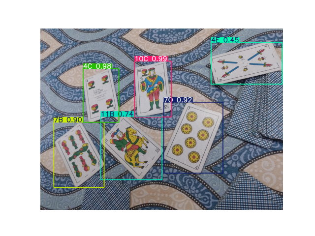

# Academic Project: Playing card identifier

This project implements a computer vision pipeline leveraging **YOLOv8** for the detection of playing cards in the context of the traditional Argentine card game, *Truco*. The primary objective is to develop an algorithm capable of calculating the *Envido* score based on detected cards.

## Key Contributions

1. **Collaborative Dataset Creation**  
   - Participated in the development of a custom dataset by capturing and annotating images of *Truco* cards.

2. **Dataset Processing and Enhancement**  
   - Conducted thorough data cleaning and analysis.  
   - Applied **data augmentation techniques** to generate synthetic samples, increasing dataset diversity and robustness.

3. **Model Training and Optimization**  
   - Trained a YOLOv8 model on the enhanced dataset.  
   - Evaluated performance using key metrics (e.g., mAP, precision, recall).  
   - Iteratively fine-tuned hyperparameters to improve detection accuracy.

## Project Highlights

This project integrates advanced deep learning techniques with traditional game mechanics, showcasing the practical application of AI in card recognition systems. The approach is designed to enhance gameplay understanding and contribute to AI-driven solutions in recreational contexts.

## Example of Card Detection

Below is an example of the YOLOv8 model detecting and identifying cards from the *Truco* deck. The bounding boxes and labels represent the detections made by the model.

## Report
The project report is located in the file:
`Final Project Report - Computer Vision - Leandro Salvañá.pdf`

## Notebooks

- `00.run_envido.ipynb` - Code for inference on the evaluation dataset and JSON creation.
- `1_DatasetPersonal.ipynb` - Dataset cleaning, processing, augmentation, and splitting.
- `2_Entrenamiento.ipynb` - First training, optimization, and second training.
- `Inferencia_GPU.ipynb` - Inference on GPU.

## Usage
Place your annotated data into the `Data` directory in a directory called `Dataset` with YOLO format and run the `1_DatasetPersonal.ipynb` and `2_Entrenamiento.ipynb` notebooks.

## Project Directory Structure

├── Data  
│   ├── Dataset  
│   ├── Splitted_Dataset  
│   │   ├── test  
│   │   │   ├── images  
│   │   │   └── labels  
│   │   ├── train  
│   │   │   ├── images  
│   │   │   └── labels  
│   │   └── val  
│   │       ├── images  
│   │       └── labels  
│   ├── eval  
│   │   ├── images  
│   │   │   ├── train  
│   │   │   └── val  
│   │   └── labels  
│   │       ├── train  
│   │       └── val  
│   └── label_errors  
├── Results  
│   ├── Envido  
│   │   └── leandro_salvañá  
│   ├── checkpoints  
│   ├── test_results  
│   ├── yolov8_retraining  
│   │   └── weights  
│   └── yolov8_training  
│       ├── checkpoints  
│       └── weights  
└── model  
    └── weights  

### Directory Descriptions

- **Data/Dataset**: Contains the original dataset.
- **Data/Splitted_Dataset**: Contains the dataset after processing, augmentation, and splitting.
- **Data/eval**: Structure provided by the instructors for evaluation.
- **Data/label_errors**: Images detected with annotation errors during dataset processing.
- **Results**: Contains all the images and metric documents from the trainings.
- **Results/yolov8_training**: Files related to the first training.
- **Results/yolov8_retraining**: Files related to the second training.
- **Results/Envido**: Results from the evaluation notebook where the JSON is created.
- **model/weights**: Copy of the best weights from the second training.
